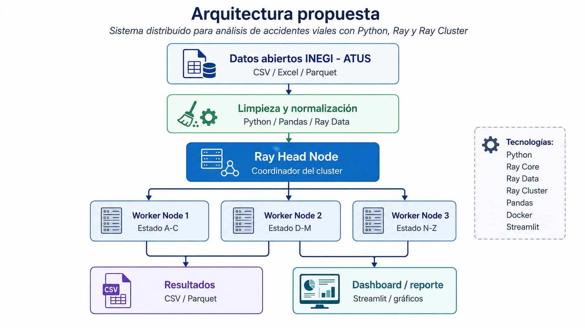

# Arquitectura del pipeline ATUS

Este repositorio implementa la parte de recoleccion distribuida y limpieza descrita en el PDF del proyecto: Python, Pandas, Ray, Ray Cluster y salida CSV/Parquet para que despues se haga el analisis estadistico y el dashboard.

## Flujo

1. **Datos abiertos INEGI - ATUS**
   - Entrada local: `conjunto_de_datos_atus_anual_csv/`.
   - Archivos anuales: `conjunto_de_datos/atus_anual_YYYY.csv`.
   - Catalogos: entidad, municipio, mes, hora, minuto, edad y dia.

2. **Ray Head Node**
   - Ejecuta `atus_pipeline.cli`.
   - Carga catalogos y descubre archivos anuales.
   - Divide el trabajo en 3 nodos logicos como el diagrama:
     - `worker_node_1_a_c`: estados A-C.
     - `worker_node_2_d_m`: estados D-M.
     - `worker_node_3_n_z`: estados N-Z.
   - Lanza tareas Ray remotas y reduce los resultados parciales.

3. **Ray Worker Nodes**
   - Cada worker lee los CSV en bloques Pandas.
   - Filtra solo las entidades asignadas a su grupo.
   - Limpia tipos, codigos, fechas, horas, categorias y valores especiales.
   - Escribe particiones limpias y calcula agregados parciales.

4. **Resultados**
   - `data/processed/clean_csv/`: particiones limpias por nodo y año.
   - `data/processed/clean_parquet/`: particiones Parquet si se usa `--write-parquet`.
   - `data/processed/summary/`: archivos listos para analisis y dashboard.

5. **Ray Data para la siguiente etapa**
   - `atus_pipeline.ray_dataset.load_clean_dataset()` carga las particiones limpias como `ray.data.Dataset`.
   - Parquet se usa primero si existe; si no, se leen los CSV limpios.
   - Esto deja la entrada preparada para analisis distribuido adicional o Streamlit.

## Imagen de referencia del PDF

## Distribucion

La particion por estados evita que todos los workers produzcan los mismos resultados. El procesamiento por bloques mantiene estable la memoria, importante porque los CSV anuales pesan varios GB en conjunto.

En una sola computadora, Ray crea workers locales. En un cluster real, el mismo comando puede usar `--ray-address auto` despues de iniciar un head node y conectar workers.
